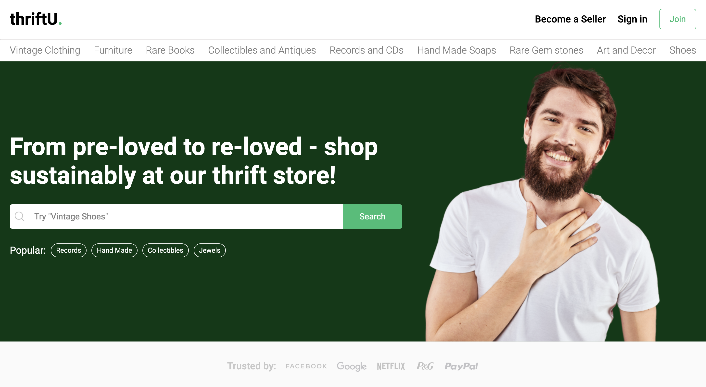
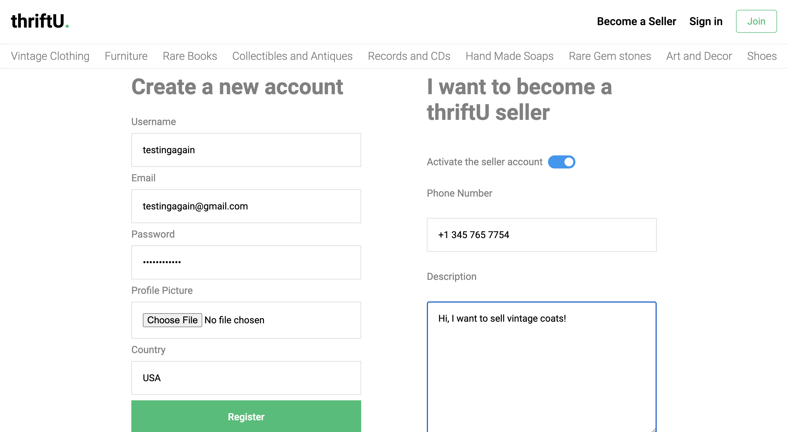
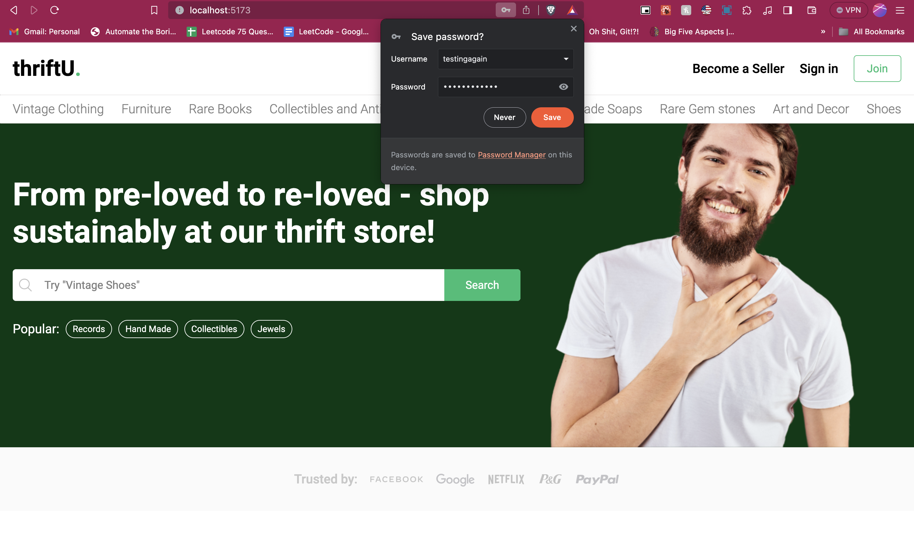

🌱 MERN Stack Thrift Store: Sustainable Shopping for a Greener Tomorrow 🌍

## Getting Started
### Starting the API Server

To start the API server, open your terminal and run the following commands:
```bash
cd api
yarn start
```
### Starting the Client Side
To start the client application, open your terminal and run the following commands:
```bash
cd client
yarn run dev
```
Technologies Used:

React.js: The frontend of the application is built with React.js (powered by Vite), offering an intuitive and engaging user interface for an optimal shopping experience.


Node.js: Leveraging the power of Node.js, the server-side logic is handled efficiently, ensuring seamless operations and high performance.

MongoDB: I employ MongoDB for database management, facilitating robust data storage and retrieval for our application.

Express.js: The RESTful APIs are developed using Express.js, enhancing the application's functionality and enabling smooth user interaction.

Stripe: For secure and reliable payment processing, Stripe is integrate, a trusted payment gateway, to ensure smooth and secure transactions.

JWT and Cookies: Security is paramount, and secure authentication using JSON Web Tokens (JWT) is implemented to safeguard user information.

Real-Time Chat: Enhancing user engagement, real-time chat functionality is added to facilitate communication between buyers and sellers.

Image Uploading with Cloudinary: The application enables users to upload images effortlessly using Cloudinary, enhancing the visual appeal of product listings.

Review and Rating System: Transparency is key, so a review and rating system to help users make informed decisions when purchasing thrifted items.

React Query: To ensure efficient data synchronization and state management, React Query is employed, ensuring a smooth and responsive user experience.

If you wish to register as a seller, you can do so during the sign-up process:


Landin page after signing up:


At the heart of the project is a commitment to environmental sustainability. By creating a thrift store application, users are encouraged to embrace a more responsible and eco-conscious approach to shopping. By offering a seamless and secure e-commerce experience, I hope to inspire positive change in the way people consume and recycle fashion and goods. 🛍️🌿
