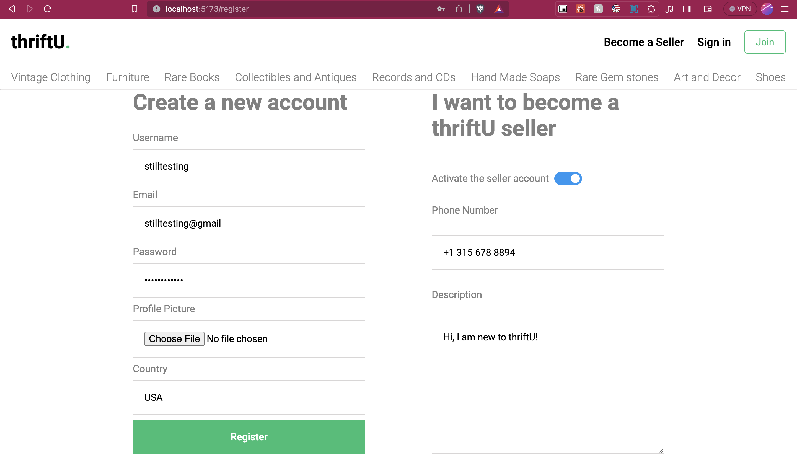
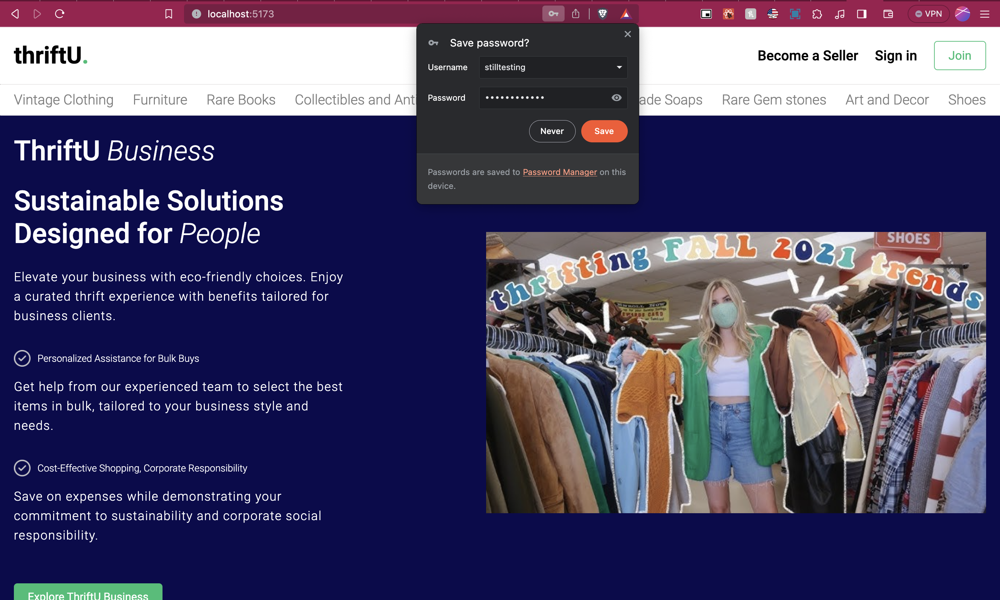

🌱 MERN Stack Thrift Store: Sustainable Shopping for a Greener Tomorrow 🌍

## Getting Started
### Starting the API Server

To start the API server, open your terminal and run the following commands:
```bash
cd api
yarn start
```
### Starting the Client Side
To start the client application, open your terminal and run the following commands:
```bash
cd client
yarn run dev
```
Technologies Used:

React.js: The frontend of the application is built with React.js (powered by Vite), offering an intuitive and engaging user interface for an optimal shopping experience.


Node.js: Leveraging the power of Node.js, the server-side logic is handled efficiently, ensuring seamless operations and high performance.

MongoDB: I employ MongoDB for database management, facilitating robust data storage and retrieval for our application.

Express.js: The RESTful APIs are developed using Express.js, enhancing the application's functionality and enabling smooth user interaction.

Stripe: For secure and reliable payment processing, Stripe is integrate, a trusted payment gateway, to ensure smooth and secure transactions.

JWT and Cookies: Security is paramount, and secure authentication using JSON Web Tokens (JWT) is implemented to safeguard user information.

Real-Time Chat: Enhancing user engagement, real-time chat functionality is added to facilitate communication between buyers and sellers.

Image Uploading with Cloudinary: The application enables users to upload images effortlessly using Cloudinary, enhancing the visual appeal of product listings.

Review and Rating System: Transparency is key, so a review and rating system to help users make informed decisions when purchasing thrifted items.

React Query: To ensure efficient data synchronization and state management, React Query is employed, ensuring a smooth and responsive user experience.


Some Features:
If you wish to register as a seller, you can do so during the sign-up process:



Landing page after signing up:



About Vite:
"Vite + ReactJS" for building modern web applications. Vite offers fast development server and build time. When used together, Vite's speed and React's component-based approach make for an efficient and enjoyable development experience.

At the heart of the project is a commitment to environmental sustainability. By creating a thrift store application, users are encouraged to embrace a more responsible and eco-conscious approach to shopping. By offering a seamless and secure e-commerce experience, I hope to inspire positive change in the way people consume and recycle fashion and goods. 🛍️🌿


# Cuisine Compass: A Restaurant Recommendation System Utilizing Sentiment Analysis

### Packages used:
Our project makes use of the following packages:
- nltk
- spacy
- sklearn
- tensorflow
- numpy
- matplotlib
- transformers
- datasets
- wordcloud
- plotly
- streamlit
- textblob
- accelerate
- ipywidgets

Refer to the requirements.txt file for all the packages. This file was generated using the command:
```bash
pip freeze > requirements.txt
```

### Guidelines on running the project
All our backend code files are in the directory named "Code". In this directory, there is another directory named "preprocessing" which contains code that was used to preprocess the original data file. The preprocessed file named "Yelp_Restaurant_Reviews.csv" is the file that is used by all the models. 

The original data file was retrieved from here: https://www.kaggle.com/datasets/farukalam/yelp-restaurant-reviews?resource=download

The 'Code' directory contains the following files:
- EDA.ipynb => This file does the Exploratory Data Analysis for our project.
- LogisticRegression_RandomForest.ipynb => This file contains code that uses the Logistic Regression and Random Forest models to do sentiment analysis.
- SVM2.ipynb => This file contains code that uses the Support Vector Machine to perform sentiment analysis.
- YelpNeuralNetwork.ipynb => This file contains code that uses Neural Networks to do sentiment analysis.
- Sentiment_analysis_using_transformers.ipynb => This file contains the code that uses the pretrained DistilBERT transformers model to perform sentiment analysis. This file also contains the implementation of the Recommendation system using the SentimentIntensityAnalyzer. Some portion of the code does the evaluation of the recommendation system with the transformers model. Finally, a restaurant.json file is created that the user interface can use to render the top rated restaurants, ratings, top reviews and must-try foods. In order to get the trained transformers model, follow this link: https://drive.google.com/file/d/1Y4mxZ7-hzlQi9OL1U0IbVYcaYBIJL85N/view?usp=sharing
- food_recommendations.pkl => This is a pickle file containing the must-try foods at each restaurant. This pickle file is used by the Sentiment_analysis_using_transformers.ipynb file.
- Yelp_Restaurant_Reviews.csv => This is the preprocessed data file which is subsequently used by all the models.

#### User Interface
To run the UI, please navigate to the directory named 'UI' and run the command:
```bash
streamlit run app.py
```

Note: Ensure that the streamlit module has been installed (included in the requirements.txt file).


